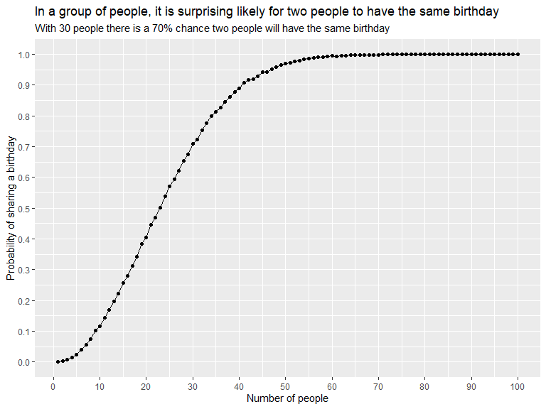

### The Birthday Problem

If we gathered 30 random people, how likely would it be that two of them
would share a birthday?

The probability is surprising: With 30 people the chance two of them
share a birthday is 70%. With 23 people the chances only drop to 50%.

Below is a monte carlo simulation of the birthay problem. I represent
the number of days in the year as integers from 1 to 366 (this included
February 29th). The method is as follows:

-   randomly sample n birthdays
-   check if there is a match
-   repeat this process many times. By checking how often a sample
    produces a match relative to the number of total samples generates
    an unbiased estimate of the probability of n people sharing a
    birthday
-   repeat all three steps above for 1 to 100 people

<br />

### Monte carlo simulation

``` r
library(tidyverse)

#function to sample n people and record the number of unique birthdays
#if there are n unique birthdays, there is no match
#if there are less than n unique birthdays there is at least one match
sample_birthdays <- function(n){
    sample(1:366, n, replace = TRUE) %>% 
        unique() %>% 
        length()
}

#function to repeatedly sample n people and check if there are matches
#this function returns the probability of n people sharing a birthday
monte_carlo_birthay <- function(n, n_sims = 10000){
    mean(rerun(n_sims, sample_birthdays(n)) %>% unlist() != n)
}

#run monte carlo simulation for 1 to 100 people
results <- tibble(n_people = 1:100) %>%
    mutate(p_share_birthday = map_dbl(n_people, monte_carlo_birthay))

results %>%
    ggplot(aes(n_people, p_share_birthday)) +
    geom_point() +
    geom_line() +
    labs(x = "Number of people",
         y = "Probability of sharing a birthday",
         title = "In a group of people, it is surprising likely for two people to have the same birthday",
         subtitle = "With 30 people there is a 70% chance two people will have the same birthday") +
    scale_x_continuous(breaks = seq(0, 100, 10)) +
    scale_y_continuous(breaks = seq(0, 1, .1))
```



<br /> <br /> <br /> <br /> <br />
